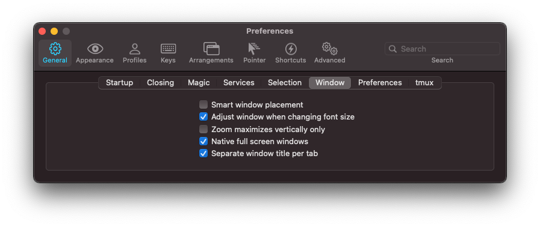

# Mac の Setup 手順

## XCode のインストール

省略

## Chrome のインストール

省略

## Microsoft Office のインストール

省略

## LINE / Slack のインストール

省略

## Iterm のインストール

https://www.iterm2.com/

## Alfred のインストール

- App store からインストールする。
https://itunes.apple.com/jp/app/alfred/id405843582?mt=12&ign-mpt=uo%3D4

- Spot Light を起動しないように、Mac のデフォルトのショートカットキーを削除する。

- Control + Space に Alfred を割り当てる。

## Tableplus のインストール

https://tableplus.io/

## MySQL Workbench のインストール

https://dev.mysql.com/downloads/workbench/

## Virtual Box のインストール
dockerあればいらないかも

https://www.virtualbox.org/

## Vagrant のインストール
dockerあればいらないかも

https://www.vagrantup.com/

## Docker のインストール
こいつがあればよい
dockerHubに登録するとなお良い（イメージとか共有できる）

###  dockerインストール

https://docs.docker.com/docker-for-mac/install/
  
### dockerHub登録

https://hub.docker.com/

## IntelliJ Ultimate のインストール

- 学生アカウント用でインストールする。

https://qiita.com/tetrapod117/items/92f965cf1928739b70e4

- メモリの割り当て量を増やす。 
→2048MBくらいあれば大丈夫そう（マシンに余裕があれば4096くらいにしよう）

## mac setup file を git clone

`$ git clone https://github.com/Kawaguchisan/mac_setup.git ~/mac_setup`

## setup.sh を叩く

`$ sh ~/mac_setup/setup.sh`

tmux を使用する際には、Iterm の設定が必要になるかも…？

## iTerm2 の設定　

要追記

```
Preferencesを開き、（macなら⌘+,で起動できる） 
1.
General→Selection
"Applications ing terminal may access clipboard" にチェックを入れる
2.
General→Window
"Native full screen windows" にチェックを入れる
(3.tmuxがうまく起動しない人は)
General→tmux
でゴニョゴニョすると毎回tmuxを打たなくても勝手に起動してくれる
```




あと、フォントとカラーの設定!


→Color PresetsにDraculaが出てこない人は佐藤まで


→fontの設定欄はiTerm2のバージョンによって多少変わる．設定するフォントは`Source Code Pro for Powerline`の14ptが良いと思う（趣味の領域）

